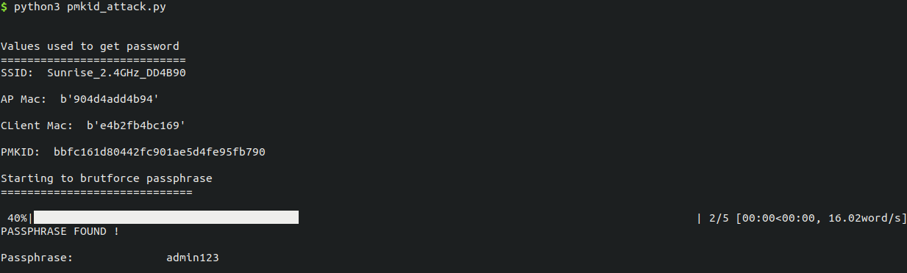
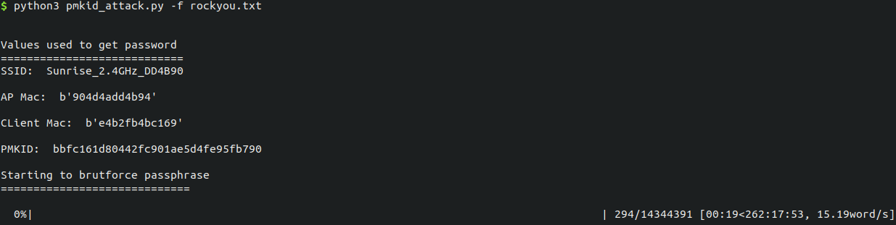
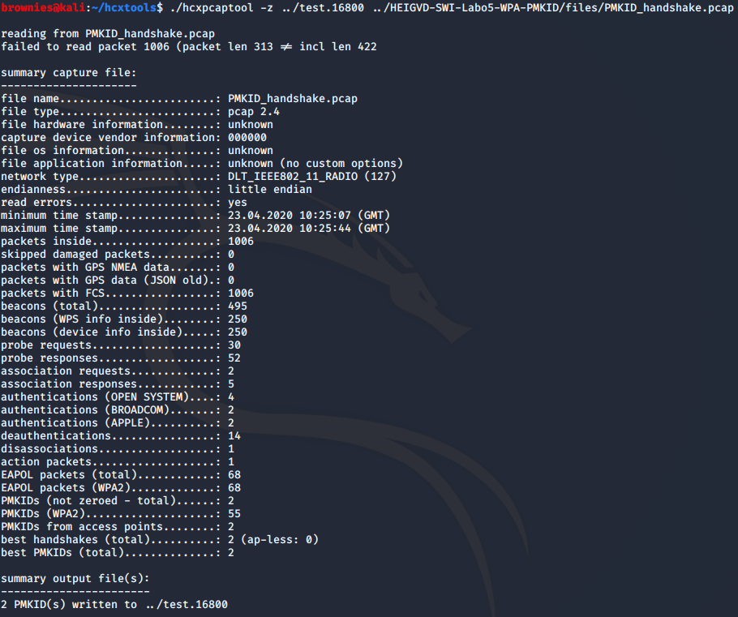
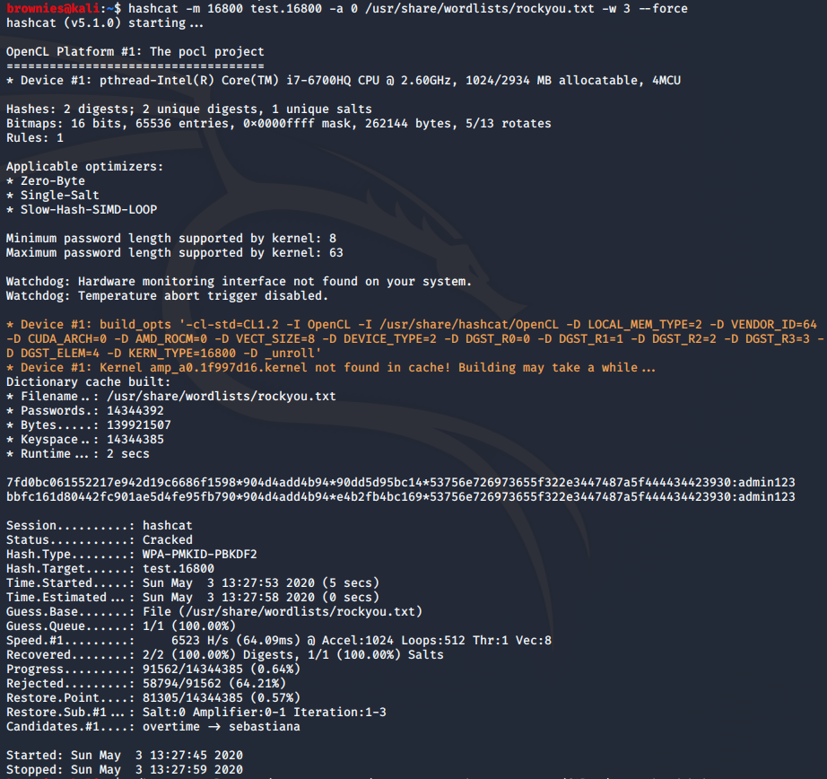
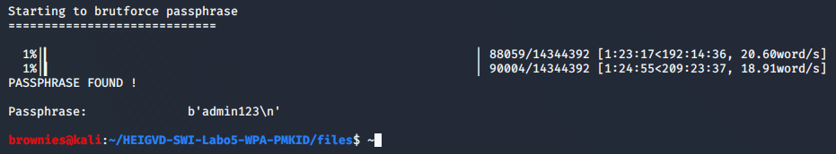

- [Livrables](#livrables)

- [Échéance](#échéance)

- [Travail à réaliser](#travail-à-réaliser)

# Sécurité des réseaux sans fil

## Laboratoire WPA - PMKID


## Travail à réaliser

### 1. Obtention de la PMKID et des paramètres pour la dérivation de la PMK  

Dans cette première partie, vous allez réutiliser le script de dérivation de clés que vous avez rendu pour le [labo WPA](https://github.com/arubinst/HEIGVD-SWI-Labo4-WPA). Il vous faudra également le fichier de capture [PMKID_handshake.pcap](files/PMKID_handshake.pcap) contenant une tentative d’authentification WPA pas réussie réalisée par un attaquant.

La PMKID est contenue dans le premier message du 4-way handshake de certains AP. Les AP de l'opérateur Sunrise sont vulnérables. Il s'agit donc d'un AP de Sunrise qui a été utilisé pour faire [la capture](files/PMKID_handshake.pcap). 

Voici ce que vous devez faire pour cette première partie :

- __Modifier votre script WPA__ pour qu’il récupère automatiquement, à partir de la capture, la valeur de la PMKID
- Vous aurez aussi besoin de récupérer les valeurs du ```ssid```, ```APmac``` et ```Clientmac``` (ceci est normalement déjà fait par votre script) 


### 2. Cracker la Passphrase utilisant l'attaque PMKID

L'attaque PMKID est une attaque par dictionnaire qui calcule systématiquement une PMK à partir de la passphrase. Cette PMK est utilisée comme clé pour SHA-1 calculé sur une concatenation du string "PMK Name" et les adresses MAC de l'AP et la STA. Les premiers 128 bits (6 octets) du résultat de ce calcul doivent correspondre à la valeur de la PMKID obtenue à partir du premier message du 4-way handshake.

Utilisant votre script précédent, le modifier pour réaliser les taches suivantes :

- Lire une passphrase à partir d’un fichier (wordlist) &rarr; __La passphrase utilisée dans la capture es ```admin123```__
- Dériver la PMK à partir de la passphrase que vous venez de lire et des autres éléments nécessaires contenus dans la capture (cf [exercice 1](#1-obtention-de-la-pmkid-et-des-paramètres-pour-la-dérivation-de-la-pmk))
- Calculer la PMKID (cf vidéo YouTube)
- Comparer la PMKID calculée avec celle récupérée de la capture :
   - Identiques &rarr; La passphrase utilisée est correcte
   - Différents &rarr; Essayer avec une nouvelle passphrase

> Le script se trouve [ici](.files/pmkid_attack.py). 
>
> Nous avons fait en sorte d'afficher une barre de progression afin que l'on puisse suivre visuellement le nombre de mots de passe testés. Cette barre nécessite le paquet pip `tqdm`. S'il n'est pas installé, le script s’exécutera normalement sans faire d'erreur (mais sans barre de progression).
>
> Il est possible de donner en entrée un fichier avec des mots de passe à l'aide du paramètre `-f` . Si aucun fichier n'est donné, le script utilisera pas défaut le fichier `passwords.txt` qui se trouve à coté de lui.
>
> 
>
> 
>
> On peut constater sur la capture ci-dessus que le script n'est pas très rapide pour tester une liste de mots de passe. Pour une vraie solution de crackage de mot de passe, il faudrait en multi-threader l'exécution.


### 3. Attaque hashcat

A manière de comparaison, réaliser l'attaque sur le [fichier de capture](files/PMKID_handshake.pcap) utilisant la méthode décrite [ici](https://hashcat.net/forum/thread-7717.html).

> Comme dans la méthode donnée, nous avons d'abord exécuté la commande suivante :
>
> ```bash
> ./hcxpcaptool -z ../test.16800 ../HEIGVD-SWI-Labo5-WPA-PMKID/files/PMKID_handshake.pcap
> ```
>
> Cette commande a réussi à trouver 2 PMKIDs dans notre capture. 
>
> 
>
> Ensuite, nous utilisons `hashcat` avec le dictionnaire `rockyou.txt`, disponible nativement avec Kali Linux, afin d'essayer de trouver le mot de passe.
>
> 
>
> Après seulement 2 secondes (mais en ayant chargé le dictionnaire dans le cache au préalable), `hashcat` nous donne le mot de passe qui était `admin123`.
>
> Si nous utilisons notre script (mono-threadé) il nous faut beaucoup plus de temps (01h24). Et cela en tenant compte que le mot de passe recherché se trouve relativement au début du dictionnaire.
>
> 


## Livrables

Un fork du repo original . Puis, un Pull Request contenant **vos noms** et :

- Script ```pmkid_attack.py``` **abondamment commenté/documenté** + fichier wordlist
   - Capture d’écran de votre script en action
- Captures d'écran de votre exercice 3
-	Envoyer le hash du commit et votre username GitHub et **les noms des participants** par email au professeur et à l'assistant


## Échéance

Le 04 mai 2020 à 23h59
